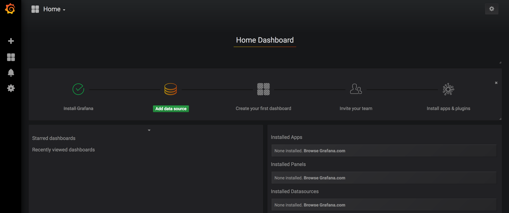
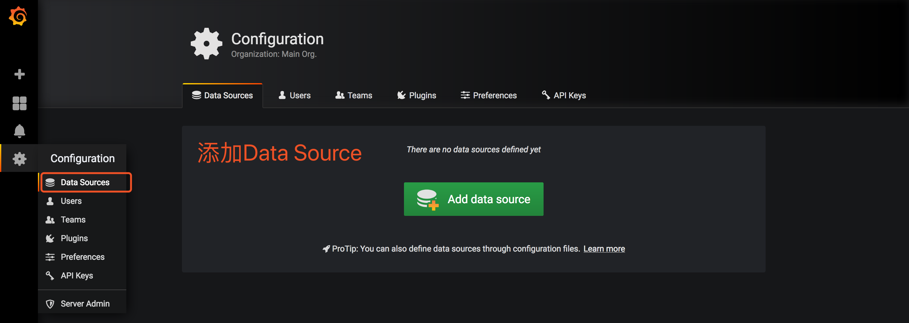
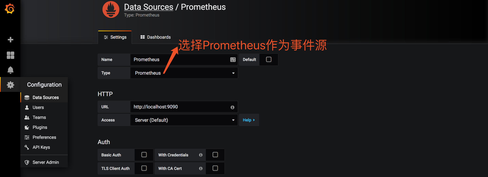
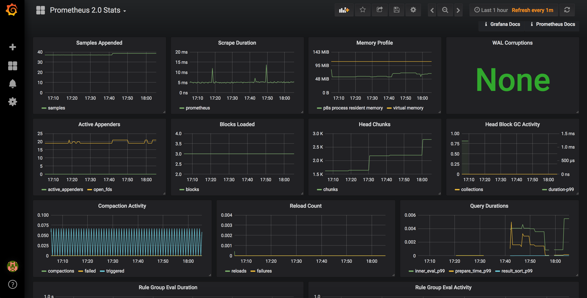

# Grafana 使用

Grafana 是一套开源的分析监视平台，支持 Graphite, InfluxDB, OpenTSDB, Prometheus, Elasticsearch, CloudWatch 等数据源，其 UI 非常漂亮且高度定制化，这是 Prometheus web console 不具备的。

### 安装Grafana和运行程序（也可以在Zabbix的Server上面安装Grafana）

https://grafana.com/grafana/download

参考官网，安装grafana http://docs.grafana.org/installation/rpm/

```bash
sudo yum install https://s3-us-west-2.amazonaws.com/grafana-releases/release/grafana-5.2.2-1.x86_64.rpm
```

启动Grafana，注意EC2安全组入站要开放3000端口。

```bash
sudo service grafana-server start
Starting Grafana Server: ...                               [  OK  ]
```

配置自启动

```bash
sudo /sbin/chkconfig --add grafana-server
```

默认网页界面访问范围地址 http://54.223.231.9:3000/login，缺省的帐号/密码为admin/admin。




添加数据源





添加成功之后，会提示“Data source is working”。




