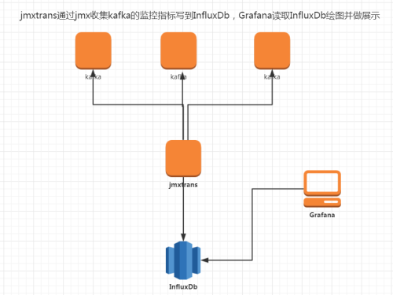
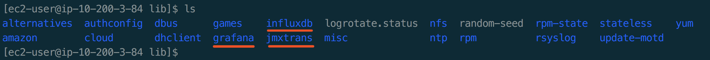
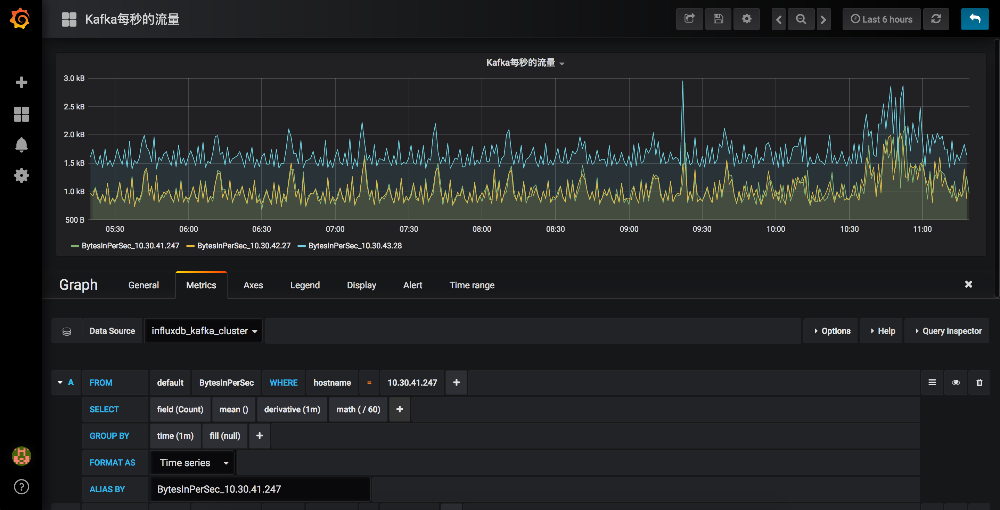

# Kafka

##### kafka监控实战(jmxtrans+InfluxDb+Grafana)

http://blog.51cto.com/navyaijm/1958376

##### 升级Java（一定需要升级到java-1.8.0以上）

```bash
sudo yum install java-1.8.0
sudo yum remove java-1.7.0-openjdk
```

如果没有下载Java，请通过访问以下链接并下载最新版本来下载最新版本的JDK。

http://www.oracle.com/technetwork/java/javase/downloads/index.html

```bash
wget https://s3.cn-north-1.amazonaws.com.cn/danrong/aws-maodanrong-document-backup/Develop-Tool/develop-tool/java-jdk-8u181-linux-x64.tar.gz/jdk-8u181-linux-x64.tar.gz
[ec2-user@ip-10-200-xx-xx jvm]$ sudo cp jdk-8u181-linux-x64.tar.gz /usr/lib/jvm/
[ec2-user@ip-10-200-xx-xx jvm]$ sudo tar zxvf jdk-8u181-linux-x64.tar.gz
[ec2-user@ip-10-200-xx-xx jvm]$ sudo vim /etc/profile
export JAVA_HOME=/usr/lib/jvm/jdk1.8.0_181
export JRE_HOME=${JAVA_HOME}/jre
export CLASSPATH=.:${JAVA_HOME}/lib:${JRE_HOME}/lib
export PATH=${JAVA_HOME}/bin:$PATH
[ec2-user@ip-10-200-xx-xx jvm]$ source /etc/profile
[ec2-user@ip-10-200-xx-xx jvm]$ java -version
java version "1.8.0_181"
Java(TM) SE Runtime Environment (build 1.8.0_181-b13)
Java HotSpot(TM) 64-Bit Server VM (build 25.181-b13, mixed mode)
```

##### 原理

环境

```bash
a、10.10.10.10   InfluxDb(InfluxDb、Grafana用了同一台服务器)
b、10.10.10.100  Grafana
c、10.10.30.69   jmxtrans
d、kafka集群
   10.30.41.247  sgp_prod_bdp_kafka_ec2_1
   10.30.42.27   sgp_prod_bdp_kafka_ec2_1
   10.10.20.16   sgp_prod_bdp_kafka_ec2_3
   10.10.20.17  node4
```

架构



配置规则 - http://blog.51cto.com/navyaijm/1958376

1、jmxtrans我们可以分别在每台kafka节点上部署，也可以部署到一台机器上。我这里是选择了后者，因为我的集群小，这样配置文件可以集中管理，如果集群比较大，可以考虑分散部署。

2、关于jmxtrans的配置文件，分全局指标（每个kafka节点）和topic指标，全局指标每个节点一个配置文件，命名规则：base_10.10.20.14.json，topic指标是每个topic一个配置文件，命名规则：falcon_monitor_us_17.json

##### 下载Kafka（完成）

https://mirrors.cnnic.cn/apache/kafka/2.0.0/

```bash
[ec2-user@ip-10-200-xx-xx ~]$ wget https://mirrors.cnnic.cn/apache/kafka/2.0.0/kafka_2.12-2.0.0.tgz
[ec2-user@ip-10-200-xx-xx ~]$ tar -xzf kafka_2.12-2.0.0.tgz 
[ec2-user@ip-10-200-xx-xx ~]$ ll
总用量 48252
drwxr-xr-x 6 ec2-user ec2-user     4096 7月  24 14:20 kafka_2.12-2.0.0
-rw-rw-r-- 1 ec2-user ec2-user 49405896 7月  28 20:01 kafka_2.12-2.0.0.tgz
[ec2-user@ip-10-200-xx-xx ~]$ cd kafka_2.12-2.0.0
```

##### 下载jmx_prometheus_javaagent（可以跳过）

https://repo1.maven.org/maven2/io/prometheus/jmx/jmx_prometheus_javaagent/

```bash
wget https://repo1.maven.org/maven2/io/prometheus/jmx/jmx_prometheus_javaagent/0.9/jmx_prometheus_javaagent-0.9.jar
```

##### 下载jmx_exporter（可以跳过）

https://github.com/prometheus/jmx_exporter/tree/master/example_configs

```bash
wget https://github.com/prometheus/jmx_exporter/blob/master/example_configs/kafka-2_0_0.yml
```

##### 下载prometheus（可以跳过）

https://prometheus.io/download/ 

备用地址: https://s3.cn-north-1.amazonaws.com.cn/danrong/aws-maodanrong-document-backup/Develop-Tool/develop-tool/prometheus-2.3.2.linux-amd64/prometheus-2.3.2.linux-amd64.tar.gz

```bash
wget https://github.com/prometheus/prometheus/releases/download/v2.3.2/prometheus-2.3.2.linux-amd64.tar.gz
tar -xvzf prometheus-2.3.2.linux-amd64.tar.gz
cd prometheus-2.3.2.linux-amd64
./promtool --version
```

```bash
整个工程路径如下
[ec2-user@ip-10-200-xx-xx ~]$ ll
总用量 75020
drwxr-xr-x 6 ec2-user ec2-user     4096 8月  26 13:41 kafka_2.12-2.0.0
-rw-rw-r-- 1 ec2-user ec2-user 49405896 7月  28 20:01 kafka_2.12-2.0.0.tgz
drwxr-xr-x 4 ec2-user ec2-user     4096 7月  12 15:05 prometheus-2.3.2.linux-amd64
-rw-rw-r-- 1 ec2-user ec2-user 27404353 8月  26 13:20 prometheus-2.3.2.linux-amd64.tar.gz
[ec2-user@ip-10-200-xx-xx ~]$ cd kafka_2.12-2.0.0
[ec2-user@ip-10-200-xx-xx kafka_2.12-2.0.0]$ ll
总用量 1372
drwxr-xr-x 3 ec2-user ec2-user    4096 7月  24 14:20 bin
drwxr-xr-x 2 ec2-user ec2-user    4096 7月  24 14:20 config
-rw-rw-r-- 1 ec2-user ec2-user 1252964 8月  26 13:41 jmx_prometheus_javaagent-0.9.jar
-rw-rw-r-- 1 ec2-user ec2-user   97845 8月  26 13:41 kafka-2_0_0.yml
drwxr-xr-x 2 ec2-user ec2-user    4096 8月  26 13:13 libs
-rw-r--r-- 1 ec2-user ec2-user   28824 7月  24 14:17 LICENSE
-rw-r--r-- 1 ec2-user ec2-user     336 7月  24 14:17 NOTICE
drwxr-xr-x 2 ec2-user ec2-user    4096 7月  24 14:20 site-docs
```

##### 启动Zookeeper

We start a Zookeeper (a Kafka dependency) and Kafka with the JMX exporter running as a Java agent

启动ZK，启动Kafka，把日志内容打到回收站里面去，在后台运行。会返回kafka的进程号。

```bash
[ec2-user@ip-10-200-xx-xx kafka_2.12-2.0.0]$ ./bin/zookeeper-server-start.sh config/zookeeper.properties & KAFKA_OPTS="$KAFKA_OPTS -javaagent:$PWD/jmx_prometheus_javaagent-0.9.jar=7071:$PWD/kafka-2_0_0.yml"
```

克隆一个session，到另一个窗口启动（完成）

```bash
[ec2-user@ip-10-200-xx-xx kafka_2.12-2.0.0]$ ./bin/kafka-server-start.sh config/server.properties >/dev/null 2>&1 &
[1] 6324
```

可以通过jps查看kafka的进程号（必须要先安装Java JDK）（完成）

```bash
[ec2-user@ip-10-200-xx-xx ~]$ jps
5637 Kafka
5991 Jps
5306 QuorumPeerMain
```

这两部可以合并（完成）

```bash
./bin/zookeeper-server-start.sh config/zookeeper.properties & KAFKA_OPTS="$KAFKA_OPTS -javaagent:$PWD/jmx_prometheus_javaagent-0.9.jar=7071:$PWD/kafka-2_0_0.yml" \
./bin/kafka-server-start.sh config/server.properties >/dev/null 2>&1 &
```

建议采用这种方式启动（完成）**

```bash
JMX_PORT=9999 nohup ./bin/kafka-server-start.sh config/server.properties >/dev/null 2>&1 &
```

如果需要重启Kafka

```bash
./bin/kafka-server-stop.sh
./bin/kafka-server-start.sh config/server.properties >/dev/null 2>&1 &
```

重启后观察可以发现JMX已经启动了（查看9999端口是否开启）

```bash
[ec2-user@ip-10-200-xx-xx ~]$ netstat -an | grep 9999
tcp        0      0 :::9999                     :::*                        LISTEN
```

##### 安装influxdb（完成）

https://portal.influxdata.com/downloads

```
wget https://dl.influxdata.com/influxdb/releases/influxdb-1.6.1.x86_64.rpm
sudo yum localinstall influxdb-1.6.1.x86_64.rpm
```

##### 安装jmxtrans（完成）

jmxtrans它是一个通过jmx采集java应用的数据采集器，他的输出可以是Graphite、StatsD、Ganglia、InfluxDb等等。只要java应用开启了JMX端口，就可以进行采集。非java应用，jmxtrans监控不了，而且不开启JMX端口，jmxtrans也监控不了。

http://central.maven.org/maven2/org/jmxtrans/jmxtrans/

```bash
wget http://central.maven.org/maven2/org/jmxtrans/jmxtrans/270/jmxtrans-270.rpm
[ec2-user@ip-10-200-xx-xx ~]$ rpm -ivh jmxtrans-270.rpm
错误：can't create 事务 lock on /var/lib/rpm/.rpm.lock (权限不够)
[ec2-user@ip-10-200-xx-xx ~]$ sudo rpm -ivh jmxtrans-270.rpm
准备中...                          ################################# [100%]
正在升级/安装...
   1:jmxtrans-270-1                   ################################# [100%]
[ec2-user@ip-10-200-xx-xx ~]$ ll
总用量 297528
```

##### 部署方式

由于jmx是通过网络连接的，因此jmxtrans的部署方案有2种

1. 集中式，在一台服务器上部署一个JMXtrans，分别连接至所有的Kafka实例，并将数据吐到InfluxDB。为了减少网络传输，可以考虑部署到InfluxDB的服务器上
2. 分布式，每个Kafka实例部署一个JMXtrans

这里我们采用了方案2。如果JMX能够支持UNIX socket方式连接方案就更完美了。socket连接较TCP连接开销更小，效率更高，非常适合同一台服务器上2个进程之间的通信

##### 下载grafana（完成）sgp_prod_bdp_kafk-monitor-grafana

```bash
sudo yum install https://s3-us-west-2.amazonaws.com/grafana-releases/release/grafana-5.2.2-1.x86_64.rpm
```

或者

```bash
aws s3 cp s3://danrong/aws-maodanrong-document-backup/Develop-Tool/develop-tool/grafana-5.2.2-1.x86_64.rpm/grafana-5.2.2-1.x86_64.rpm .
wget https://s3.cn-north-1.amazonaws.com.cn/danrong/aws-maodanrong-document-backup/Develop-Tool/develop-tool/grafana-5.2.2-1.x86_64.rpm/grafana-5.2.2-1.x86_64.rpm
sudo yum localinstall grafana-5.2.2-1.x86_64.rpm
```

默认安装路径 /usr/share

默认配置文件路径/var/lib/



##### 启动influxdb（完成）sgp_prod_bdp_kafk-monitor-grafana

```bash
[ec2-user@ip-10-200-xx-xx init.d]$ cd /etc/init.d
[ec2-user@ip-10-200-xx-xx init.d]$ ./influxdb start
You must be root to run this script
[ec2-user@ip-10-200-xx-xx init.d]$ sudo ./influxdb start
Starting influxdb...
influxdb process was started [ OK ]
```

##### 进入influxdb（完成）

```bash
[ec2-user@ip-10-200-xx-xx init.d]$ cd /etc/init.d
[ec2-user@ip-10-200-xx-xx init.d]$ influx
Connected to http://localhost:8086 version 1.6.1
InfluxDB shell version: 1.6.1
创建user
> CREATE USER "root" WITH PASSWORD '123456' WITH ALL PRIVILEGES ##添加一个账号
创建database
> create database "jmxDB"
> show databases
name: databases
name
----
_internal
jmxDB
> show measurements
name: measurements
name
----
BytesInPerSec
BytesOutPerSec
BytesRejectedPerSec
GC
MemoryUsage
MessagesInPerSec
ReplicaFetcherManager
ReplicaManager
Thread
TotalTimeMs
```

**Debug文档 http://www.cnblogs.com/ygwx/p/5411990.html** 

/kafka/kafka_2.11-2.0.0/bin

```bash
第一步: 在kafka集群的所有机器上安装JMXTrans
第二步: 
编辑 “kafka-run-class.sh”
KAFKA_JMX_OPTS="-Dcom.sun.management.jmxremote=true -Dcom.sun.management.jmxremote.authenticate=false -Dcom.sun.management.jmxremote.ssl=false "
第三步: 编辑 “kafka-server-start.sh” 
export JMX_PORT=${JMX_PORT:-9999}
[ec2-user@ip-10-200-xx-xx init.d]$ export JMX_PORT=${JMX_PORT:-9999}
```

```bash
CREATE DATABASE "jmxDB"  --创建数据库
show databases           --展示所有数据库
use jmxDB                --使用数据库
```

##### 启动jmxtrans（完成）sgp_prod_bdp_kafk-monitor-jxmtrans

```bash
[ec2-user@ip-10-200-xx-xx lib]$ cd /etc/init.d/
[ec2-user@ip-10-200-xx-xx init.d]$ sudo ./jmxtrans start
Starting JmxTrans...
JmxTrans is already running.
(备选)
[ec2-user@ip-10-200-xx-xx init.d]$ sudo ./jmxtrans start /var/lib/jmxtrans/base_10.30.41.247.json # 也可以指定json文件路径

进入jmxtrans目录
/var/log/jmxtrans/jmxtrans.log
监听产生的日志进行debug
tailf jmxtrans.log

[ec2-user@ip-10-30-22-192 init.d]$ cd /var/lib/jmxtrans/
[damon@ip-10-30-22-192 jmxtrans]$ ll
-rw-r--r-- 1 root root 8480 Aug 30 02:06 base_10.30.41.247.json
-rw-r--r-- 1 root root 8479 Aug 30 02:08 base_10.30.42.27.json
-rw-r--r-- 1 root root 8479 Aug 30 02:08 base_10.30.43.28.json
```

全局配置，base_10.30.41.247.json、base_10.30.42.27.json、base_10.30.43.28.json

```json
{
  "servers" : [ {
    "port" : "9999",
    "host" : "10.30.43.28",
    "queries" : [ {
      "obj" : "kafka.server:type=BrokerTopicMetrics,name=BytesInPerSec",
      "attr" : [ "Count","OneMinuteRate" ],
      "resultAlias":"BytesInPerSec",
      "outputWriters" : [ {
        "@class" : "com.googlecode.jmxtrans.model.output.InfluxDbWriterFactory",
        "url" : "http://10.30.41.132:8086/",
        "username" : "root",
        "password" : "123456",
        "database" : "jmxDB",
        "tags"     : {"application" : "BytesInPerSec"}
      } ]
    },
{
      "obj" : "kafka.server:type=BrokerTopicMetrics,name=BytesOutPerSec",
      "attr" : [ "Count","OneMinuteRate" ],
      "resultAlias":"BytesOutPerSec",
      "outputWriters" : [ {
        "@class" : "com.googlecode.jmxtrans.model.output.InfluxDbWriterFactory",
        "url" : "http://10.30.41.132:8086/",
        "username" : "root",
        "password" : "123456",
        "database" : "jmxDB",
        "tags"     : {"application" : "BytesOutPerSec"}
      } ]
    },
{
      "obj" : "kafka.server:type=BrokerTopicMetrics,name=BytesRejectedPerSec",
      "attr" : [ "Count","OneMinuteRate" ],
      "resultAlias":"BytesRejectedPerSec",
      "outputWriters" : [ {
        "@class" : "com.googlecode.jmxtrans.model.output.InfluxDbWriterFactory",
        "url" : "http://10.30.41.132:8086/",
        "username" : "root",
        "password" : "123456",
        "database" : "jmxDB",
        "tags"     : {"application" : "BytesRejectedPerSec"}
      } ]
    },
{
      "obj" : "kafka.server:type=BrokerTopicMetrics,name=MessagesInPerSec",
      "attr" : [ "Count","OneMinuteRate" ],
      "resultAlias":"MessagesInPerSec",
      "outputWriters" : [ {
        "@class" : "com.googlecode.jmxtrans.model.output.InfluxDbWriterFactory",
        "url" : "http://10.30.41.132:8086/",
        "username" : "root",
        "password" : "123456",
        "database" : "jmxDB",
        "tags"     : {"application" : "MessagesInPerSec"}
      } ]
    },
{
      "obj" : "kafka.network:type=RequestMetrics,name=RequestsPerSec,request=FetchConsumer",
      "attr" : [ "Count" ],
      "resultAlias":"RequestsPerSec",
      "outputWriters" : [ {
        "@class" : "com.googlecode.jmxtrans.model.output.InfluxDbWriterFactory",
        "url" : "http://10.30.41.132:8086/",
        "username" : "root",
        "password" : "123456",
        "database" : "jmxDB",
        "tags"     : {"request" : "FetchConsumer"}
      } ]
    },
{
      "obj" : "kafka.network:type=RequestMetrics,name=RequestsPerSec,request=FetchFollower",
      "attr" : [ "Count" ],
      "resultAlias":"RequestsPerSec",
      "outputWriters" : [ {
        "@class" : "com.googlecode.jmxtrans.model.output.InfluxDbWriterFactory",
        "url" : "http://10.30.41.132:8086/",
        "username" : "root",
        "password" : "123456",
        "database" : "jmxDB",
        "tags"     : {"request" : "FetchFollower"}
      } ]
    },
{
      "obj" : "kafka.network:type=RequestMetrics,name=RequestsPerSec,request=Produce",
      "attr" : [ "Count" ],
      "resultAlias":"RequestsPerSec",
      "outputWriters" : [ {
        "@class" : "com.googlecode.jmxtrans.model.output.InfluxDbWriterFactory",
        "url" : "http://10.30.41.132:8086/",
        "username" : "root",
        "password" : "123456",
        "database" : "jmxDB",
        "tags"     : {"request" : "Produce"}
      } ]
    },
{
      "obj" : "java.lang:type=Memory",
      "attr" : [ "HeapMemoryUsage", "NonHeapMemoryUsage" ],
      "resultAlias":"MemoryUsage",
      "outputWriters" : [ {
        "@class" : "com.googlecode.jmxtrans.model.output.InfluxDbWriterFactory",
        "url" : "http://10.30.41.132:8086/",
        "username" : "root",
        "password" : "123456",
        "database" : "jmxDB",
        "tags"     : {"application" : "MemoryUsage"}
      } ]
    },
{
      "obj" : "java.lang:type=GarbageCollector,name=*",
      "attr" : [ "CollectionCount","CollectionTime" ],
      "resultAlias":"GC",
      "outputWriters" : [ {
        "@class" : "com.googlecode.jmxtrans.model.output.InfluxDbWriterFactory",
        "url" : "http://10.30.41.132:8086/",
        "username" : "root",
        "password" : "123456",
        "database" : "jmxDB",
        "tags"     : {"application" : "GC"}
      } ]
    },
{
      "obj" : "java.lang:type=Threading",
      "attr" : [ "PeakThreadCount","ThreadCount" ],
      "resultAlias":"Thread",
      "outputWriters" : [ {
        "@class" : "com.googlecode.jmxtrans.model.output.InfluxDbWriterFactory",
        "url" : "http://10.30.41.132:8086/",
        "username" : "root",
        "password" : "123456",
        "database" : "jmxDB",
        "tags"     : {"application" : "Thread"}
      } ]
    },
{
      "obj" : "kafka.server:type=ReplicaFetcherManager,name=MaxLag,clientId=Replica",
      "attr" : [ "Value" ],
      "resultAlias":"ReplicaFetcherManager",
      "outputWriters" : [ {
        "@class" : "com.googlecode.jmxtrans.model.output.InfluxDbWriterFactory",
        "url" : "http://10.30.41.132:8086/",
        "username" : "root",
        "password" : "123456",
        "database" : "jmxDB",
        "tags"     : {"application" : "MaxLag"}
      } ]
    },
{
      "obj" : "kafka.server:type=ReplicaManager,name=PartitionCount",
      "attr" : [ "Value" ],
      "resultAlias":"ReplicaManager",
      "outputWriters" : [ {
        "@class" : "com.googlecode.jmxtrans.model.output.InfluxDbWriterFactory",
        "url" : "http://10.30.41.132:8086/",
        "username" : "root",
        "password" : "123456",
        "database" : "jmxDB",
        "tags"     : {"application" : "PartitionCount"}
      } ]
    },
{
      "obj" : "kafka.server:type=ReplicaManager,name=UnderReplicatedPartitions",
      "attr" : [ "Value" ],
      "resultAlias":"ReplicaManager",
      "outputWriters" : [ {
        "@class" : "com.googlecode.jmxtrans.model.output.InfluxDbWriterFactory",
        "url" : "http://10.30.41.132:8086/",
        "username" : "root",
        "password" : "123456",
        "database" : "jmxDB",
        "tags"     : {"application" : "UnderReplicatedPartitions"}
      } ]
    },
{
      "obj" : "kafka.server:type=ReplicaManager,name=LeaderCount",
      "attr" : [ "Value" ],
      "resultAlias":"ReplicaManager",
      "outputWriters" : [ {
        "@class" : "com.googlecode.jmxtrans.model.output.InfluxDbWriterFactory",
        "url" : "http://10.30.41.132:8086/",
        "username" : "root",
        "password" : "123456",
        "database" : "jmxDB",
        "tags"     : {"application" : "LeaderCount"}
      } ]
    },
{
      "obj" : "kafka.network:type=RequestMetrics,name=TotalTimeMs,request=FetchConsumer",
      "attr" : [ "Count","Max" ],
      "resultAlias":"TotalTimeMs",
      "outputWriters" : [ {
        "@class" : "com.googlecode.jmxtrans.model.output.InfluxDbWriterFactory",
        "url" : "http://10.30.41.132:8086/",
        "username" : "root",
        "password" : "123456",
        "database" : "jmxDB",
        "tags"     : {"application" : "FetchConsumer"}
      } ]
    },
{
      "obj" : "kafka.network:type=RequestMetrics,name=TotalTimeMs,request=FetchFollower",
      "attr" : [ "Count","Max" ],
      "resultAlias":"TotalTimeMs",
      "outputWriters" : [ {
        "@class" : "com.googlecode.jmxtrans.model.output.InfluxDbWriterFactory",
        "url" : "http://10.30.41.132:8086/",
        "username" : "root",
        "password" : "123456",
        "database" : "jmxDB",
        "tags"     : {"application" : "FetchConsumer"}
      } ]
    },
{
      "obj" : "kafka.network:type=RequestMetrics,name=TotalTimeMs,request=Produce",
      "attr" : [ "Count","Max" ],
      "resultAlias":"TotalTimeMs",
      "outputWriters" : [ {
        "@class" : "com.googlecode.jmxtrans.model.output.InfluxDbWriterFactory",
        "url" : "http://10.30.41.132:8086/",
        "username" : "root",
        "password" : "123456",
        "database" : "jmxDB",
        "tags"     : {"application" : "Produce"}
      } ]
    },
{
      "obj" : "kafka.server:type=ReplicaManager,name=IsrShrinksPerSec",
      "attr" : [ "Count" ],
      "resultAlias":"ReplicaManager",
      "outputWriters" : [ {
        "@class" : "com.googlecode.jmxtrans.model.output.InfluxDbWriterFactory",
        "url" : "http://10.30.41.132:8086/",
        "username" : "root",
        "password" : "123456",
        "database" : "jmxDB",
        "tags"     : {"application" : "IsrShrinksPerSec"}
      } ]
    }
]
  } ]
}
```

##### 监控指标

**1、全局指标**

每秒输入的流量

```bash
"obj" : "kafka.server:type=BrokerTopicMetrics,name=BytesInPerSec"
"attr" : [ "Count" ]
"resultAlias":"BytesInPerSec"
"tags"     : {"application" : "BytesInPerSec"}
```

每秒输入的流量

```bash
"obj" : "kafka.server:type=BrokerTopicMetrics,name=BytesOutPerSec"
"attr" : [ "Count" ]
"resultAlias":"BytesOutPerSec"
"tags"     : {"application" : "BytesOutPerSec"}
```

每秒输入的流量

```bash
"obj" : "kafka.server:type=BrokerTopicMetrics,name=BytesRejectedPerSec"
"attr" : [ "Count" ]
"resultAlias":"BytesRejectedPerSec"
"tags"     : {"application" : "BytesRejectedPerSec"}
```

每秒的消息写入总量

```bash
"obj" : "kafka.server:type=BrokerTopicMetrics,name=MessagesInPerSec"
"attr" : [ "Count" ]
"resultAlias":"MessagesInPerSec"
"tags"     : {"application" : "MessagesInPerSec"}
```

每秒FetchFollower的请求次数

```bash
"obj" : "kafka.network:type=RequestMetrics,name=RequestsPerSec,request=FetchFollower"
"attr" : [ "Count" ]
"resultAlias":"RequestsPerSec"
"tags"     : {"request" : "FetchFollower"}
```

每秒FetchConsumer的请求次数

```bash
"obj" : "kafka.network:type=RequestMetrics,name=RequestsPerSec,request=FetchConsumer"
"attr" : [ "Count" ]
"resultAlias":"RequestsPerSec"
"tags"     : {"request" : "FetchConsumer"}
```

每秒Produce的请求次数

```bash
"obj" : "kafka.network:type=RequestMetrics,name=RequestsPerSec,request=Produce"
"attr" : [ "Count" ]
"resultAlias":"RequestsPerSec"
"tags"     : {"request" : "Produce"}
```

内存使用的使用情况

```bash
"obj" : "java.lang:type=Memory"
"attr" : [ "HeapMemoryUsage", "NonHeapMemoryUsage" ]
"resultAlias":"MemoryUsage"
"tags"     : {"application" : "MemoryUsage"}
```

GC的耗时和次数

```bash
"obj" : "java.lang:type=GarbageCollector,name=*"
"attr" : [ "CollectionCount","CollectionTime" ]
"resultAlias":"GC"
"tags"     : {"application" : "GC"}
```

线程的使用情况

```bash
"obj" : "java.lang:type=Threading"
"attr" : [ "PeakThreadCount","ThreadCount" ]
"resultAlias":"Thread"
"tags"     : {"application" : "Thread"}
```

副本落后主分片的最大消息数量

```bash
"obj" : "kafka.server:type=ReplicaFetcherManager,name=MaxLag,clientId=Replica"
"attr" : [ "Value" ]
"resultAlias":"ReplicaFetcherManager"
"tags"     : {"application" : "MaxLag"}
```

该broker上的partition的数量

```bash
"obj" : "kafka.server:type=ReplicaManager,name=PartitionCount"
"attr" : [ "Value" ]
"resultAlias":"ReplicaManager"
"tags"     : {"application" : "PartitionCount"}
```

正在做复制的partition的数量

```bash
"obj" : "kafka.server:type=ReplicaManager,name=UnderReplicatedPartitions"
"attr" : [ "Value" ]
"resultAlias":"ReplicaManager"
"tags"     : {"application" : "UnderReplicatedPartitions"}
```

Leader的replica的数量

```bash
"obj" : "kafka.server:type=ReplicaManager,name=LeaderCount"
"attr" : [ "Value" ]
"resultAlias":"ReplicaManager"
"tags"     : {"application" : "LeaderCount"}
```

一个请求FetchConsumer耗费的所有时间

```bash
"obj" : "kafka.network:type=RequestMetrics,name=TotalTimeMs,request=FetchConsumer"
"attr" : [ "Count","Max" ]
"resultAlias":"TotalTimeMs"
"tags"     : {"application" : "FetchConsumer"}
```

一个请求FetchFollower耗费的所有时间

```bash
"obj" : "kafka.network:type=RequestMetrics,name=TotalTimeMs,request=FetchFollower"
"attr" : [ "Count","Max" ]
"resultAlias":"TotalTimeMs"
"tags"     : {"application" : "FetchFollower"}
```

一个请求Produce耗费的所有时间

```bash
"obj" : "kafka.network:type=RequestMetrics,name=TotalTimeMs,request=Produce"
"attr" : [ "Count","Max" ]
"resultAlias":"TotalTimeMs"
"tags"     : {"application" : "Produce"}
```

**2、topic的监控指标**

falcon_monitor_us每秒的写入流量

```bash
"kafka.server:type=BrokerTopicMetrics,name=BytesInPerSec,topic=falcon_monitor_us"
"attr" : [ "Count" ]
"resultAlias":"falcon_monitor_us"
"tags"     : {"application" : "BytesInPerSec"}
```

falcon_monitor_us每秒的输出流量

```bash
"kafka.server:type=BrokerTopicMetrics,name=BytesOutPerSec,topic=falcon_monitor_us"
"attr" : [ "Count" ]
"resultAlias":"falcon_monitor_us"
"tags"     : {"application" : "BytesOutPerSec"}
```

falcon_monitor_us每秒写入消息的数量

```bash
"obj" : "kafka.server:type=BrokerTopicMetrics,name=MessagesInPerSec,topic=falcon_monitor_us"
"attr" : [ "Count" ]
"resultAlias":"falcon_monitor_us"
"tags"     : {"application" : "MessagesInPerSec"}
```

falcon_monitor_us在每个分区最后的Offset

```bash
"obj" : "kafka.log:type=Log,name=LogEndOffset,topic=falcon_monitor_us,partition=*"
"attr" : [ "Value" ]
"resultAlias":"falcon_monitor_us"
"tags"     : {"application" : "LogEndOffset"}
```

##### 启动grafana（完成）

```bash
[ec2-user@ip-10-200-xx-xx init.d]$ cd /etc/init.d
[ec2-user@ip-10-200-xx-xx init.d]$ sudo service grafana-server start
Starting Grafana Server: ...                               [  OK  ] ##默认是3000端口
```

通过浏览器访问Grafana页面



测试

创建Kafka Topic

```bash
[ec2-user@ip-10-200-xx-xx lib]$ cd /etc/init.d/
[ec2-user@ip-10-200-xx-xx bin]$ ./kafka-topics.sh --create --zookeeper localhost:2181 --replication-factor 1 --partitions 1 --topic test
Created topic "test".
```

查看监听端口

[damon@ip-10-30-41-132 init.d]$ netstat -an | grep 8086

查看是否可以连接到kafka集群

telnet 10.30.41.247 9999


参考文档

https://segmentfault.com/a/1190000007381488

基于jmxtrans+influxdb+grafana实现对canal监控

https://www.cnblogs.com/wangzhisdu/p/8005962.html

kafka监控实战(jmxtrans+InfluxDb+Grafana)

http://blog.51cto.com/navyaijm/1958376

Grafana + Zabbix --- 部署分布式监控系统

http://www.cnblogs.com/yyhh/p/4792830.html#l10