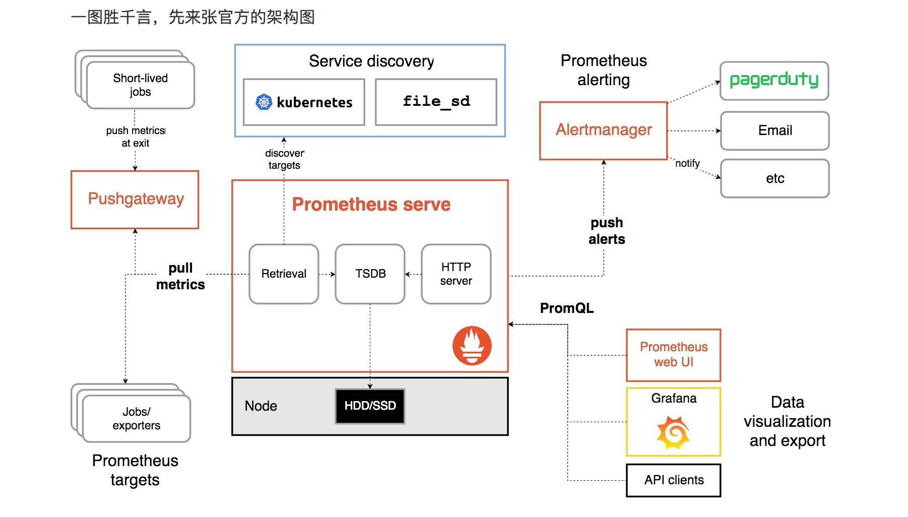

## Prometheus

[Prometheus](https://prometheus.io) 是由 SoundCloud 开源监控告警解决方案。

核心组件

- [Prometheus Server](https://github.com/prometheus/prometheus)， 主要用于抓取数据和存储时序数据，另外还提供查询和 Alert Rule 配置管理。
- [client libraries](https://prometheus.io/docs/instrumenting/clientlibs/)，用于对接 Prometheus Server, 可以查询和上报数据。
- [push gateway](https://github.com/prometheus/pushgateway) ，用于批量，短期的监控数据的汇总节点，主要用于业务数据汇报等。
- 各种汇报数据的 [exporters](https://prometheus.io/docs/instrumenting/exporters/) ，例如汇报机器数据的 node_exporter,  汇报 MongoDB 信息的 [MongoDB exporter](https://github.com/dcu/mongodb_exporter) 等等。
- 用于告警通知管理的 [alertmanager](https://github.com/prometheus/alertmanager) 。

Prometheus 的主要模块包含， Server,  Exporters, Pushgateway, PromQL, Alertmanager, WebUI 等。它大致使用逻辑是这样：

1. Prometheus server 定期从静态配置的 targets 或者服务发现的 targets 拉取数据。
2. 当新拉取的数据大于配置内存缓存区的时候，Prometheus 会将数据持久化到磁盘（如果使用 remote storage 将持久化到云端）。
3. Prometheus 可以配置 rules，然后定时查询数据，当条件触发的时候，会将 alert 推送到配置的 Alertmanager。
4. Alertmanager 收到警告的时候，可以根据配置，聚合，去重，降噪，最后发送警告。
5. 可以使用 API， Prometheus Console 或者 Grafana 查询和聚合数据。

## 注意

- Prometheus 的数据是基于时序的 float64 的值，如果你的数据值有更多类型，无法满足。
- Prometheus  不适合做审计计费，因为它的数据是按一定时间采集的，关注的更多是系统的运行瞬时状态以及趋势，即使有少量数据没有采集也能容忍，但是审计计费需要记录每个请求，并且数据长期存储，这个  Prometheus 无法满足，可能需要采用专门的审计系统。

