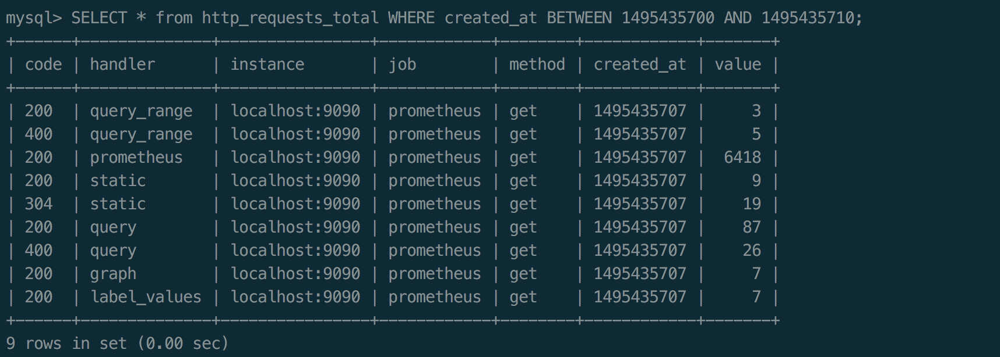

# Prometheus安装

[Prometheus](https://prometheus.io) 是一套开源的监控&报警&时间序列数据库的组合，是由 SoundCloud 开源监控告警解决方案。Prometheus基本原理是通过HTTP协议周期性抓取被监控组件的状态，这样做的好处是任意组件只要提供HTTP接口就可以接入监控系统，不需要任何SDK或者其他的集成过程。这样做非常适合虚拟化环境比如VM或者Docker 。

核心组件

- [Prometheus Server](https://github.com/prometheus/prometheus)， 主要用于抓取数据和存储时序数据，另外还提供查询和 Alert Rule 配置管理。
- [client libraries](https://prometheus.io/docs/instrumenting/clientlibs/)，用于对接 Prometheus Server, 可以查询和上报数据。
- [push gateway](https://github.com/prometheus/pushgateway) ，用于批量，短期的监控数据的汇总节点，主要用于业务数据汇报等。
- 各种汇报数据的 [exporters](https://prometheus.io/docs/instrumenting/exporters/) ，例如汇报机器数据的 node_exporter,  汇报 MongoDB 信息的 [MongoDB exporter](https://github.com/dcu/mongodb_exporter) 等等。
- 用于告警通知管理的 [alertmanager](https://github.com/prometheus/alertmanager) 。


Prometheus 的主要模块包含， Server,  Exporters, Pushgateway, PromQL, Alertmanager, WebUI 等。它大致使用逻辑是这样：

1. Prometheus server 定期从静态配置的 targets 或者服务发现的 targets 拉取数据。
2. 当新拉取的数据大于配置内存缓存区的时候，Prometheus 会将数据持久化到磁盘（如果使用 remote storage 将持久化到云端）。
3. Prometheus 可以配置 rules，然后定时查询数据，当条件触发的时候，会将 alert 推送到配置的 Alertmanager。
4. Alertmanager 收到警告的时候，可以根据配置，聚合，去重，降噪，最后发送警告。
5. 可以使用 API， Prometheus Console 或者 Grafana 查询和聚合数据。

### 注意

- Prometheus 的数据是基于时序的 float64 的值，如果你的数据值有更多类型，无法满足。
- Prometheus  不适合做审计计费，因为它的数据是按一定时间采集的，关注的更多是系统的运行瞬时状态以及趋势，即使有少量数据没有采集也能容忍，但是审计计费需要记录每个请求，并且数据长期存储，这个  Prometheus 无法满足，可能需要采用专门的审计系统。

使用 wget 下载 Prometheus 的安装包，https://prometheus.io/download/ 

```bash
[ec2-user@ip-10-200-1-142 ~]$ mkdir ~/Download
[ec2-user@ip-10-200-1-142 ~]$ cd ~/Download
[ec2-user@ip-10-200-1-142 ~]$ wget https://github.com/prometheus/prometheus/releases/download/v2.3.2/prometheus-2.3.2.linux-amd64.tar.gz
```

使用 tar 解压缩

```bash
[ec2-user@ip-10-200-1-142 Download]$ tar -xvzf prometheus-2.3.2.linux-amd64.tar.gz
[ec2-user@ip-10-200-1-142 Download]$ cd prometheus-2.3.2.linux-amd64
```

当解压缩成功后，可以运行 version 检查运行环境是否正常（）

```bash
[ec2-user@ip-10-200-1-142 prometheus-2.3.2.linux-amd64]$ ./promtool --version

```

如果你看到类似输出，表示你已安装成功:

```bash
promtool, version 2.3.2 (branch: HEAD, revision: 71af5e29e815795e9dd14742ee7725682fa14b7b)
  build user:       root@5258e0bd9cc1
  build date:       20180712-14:02:52
  go version:       go1.10.3
```

### 启动 Prometheus Server

```bash
[ec2-user@ip-10-200-1-142 prometheus-2.3.2.linux-amd64]$ ./prometheus
```

如果修改了参数，就带参数执行

```bash
./prometheus -config.file=prometheus.yml
```

如果 prometheus 正常启动，你将看到如下信息：

```bash
level=info ts=2018-08-26T03:07:25.552897231Z caller=main.go:222 msg="Starting Prometheus" version="(version=2.3.2, branch=HEAD, revision=71af5e29e815795e9dd14742ee7725682fa14b7b)"
level=info ts=2018-08-26T03:07:25.552965313Z caller=main.go:223 build_context="(go=go1.10.3, user=root@5258e0bd9cc1, date=20180712-14:02:52)"
level=info ts=2018-08-26T03:07:25.55300173Z caller=main.go:224 host_details="(Linux 4.14.62-65.117.amzn1.x86_64 #1 SMP Fri Aug 10 20:03:52 UTC 2018 x86_64 ip-10-200-1-142 (none))"
level=info ts=2018-08-26T03:07:25.553032931Z caller=main.go:225 fd_limits="(soft=1024, hard=4096)"
level=info ts=2018-08-26T03:07:25.553789727Z caller=main.go:533 msg="Starting TSDB ..."
level=info ts=2018-08-26T03:07:25.554992142Z caller=web.go:415 component=web msg="Start listening for connections" address=0.0.0.0:9090
level=info ts=2018-08-26T03:07:25.560573271Z caller=main.go:543 msg="TSDB started"
level=info ts=2018-08-26T03:07:25.560603818Z caller=main.go:603 msg="Loading configuration file" filename=prometheus.yml
level=info ts=2018-08-26T03:07:25.561383937Z caller=main.go:629 msg="Completed loading of configuration file" filename=prometheus.yml
level=info ts=2018-08-26T03:07:25.561415061Z caller=main.go:502 msg="Server is ready to receive web requests."
```

默认端口是9090，当 Prometheus 启动后，你可以通过浏览器来访问地址: http://54.223.231.9:9090/graph


在默认配置中，我们已经添加了 Prometheus Server 的监控，所以我们现在可以使用 `PromQL` （Prometheus Query Language）来查看，比如


### 总结

1. 可以看出 Prometheus 二进制安装非常方便，没有依赖，自带查询 web 界面。
2. 在生产环境中，我们可以将 Prometheus 添加到 init 配置里，或者使用 supervisord 作为服务自启动。

# Prometheus数据模型

Prometheus 存储的是[时序数据](https://en.wikipedia.org/wiki/Time_series), 即按照相同时序(相同的名字和标签)，以时间维度存储连续的数据的集合。

### 时序索引

时序(time series) 是由名字(Metric)，以及一组 key/value 标签定义的，具有相同的名字以及标签属于相同时序。

时序的名字由 ASCII 字符，数字，下划线，以及冒号组成，它必须满足正则表达式 `[a-zA-Z_:][a-zA-Z0-9_:]*`, 其名字应该具有语义化，一般表示一个可以度量的指标，例如: `http_requests_total`, 可以表示 http 请求的总数。

时序的标签可以使 Prometheus 的数据更加丰富，能够区分具体不同的实例，例如 `http_requests_total{method="POST"}` 可以表示所有 http 中的 POST 请求。

标签名称由 ASCII 字符，数字，以及下划线组成， 其中 `__` 开头属于 Prometheus 保留，标签的值可以是任何 Unicode 字符，支持中文。

### 时序样本

按照某个时序以时间维度采集的数据，称之为样本，其值包含：

- 一个 float64 值
- 一个毫秒级的 unix 时间戳

### 时序 4 种类型

Prometheus 时序数据分为 [Counter](https://prometheus.io/docs/concepts/metric_types/#counter), [Gauge](https://prometheus.io/docs/concepts/metric_types/#gauge), [Histogram](https://prometheus.io/docs/concepts/metric_types/#histogram), [Summary](https://prometheus.io/docs/concepts/metric_types/#summary) 四种类型。

### Counter

Counter 表示收集的数据是按照某个趋势（增加／减少）一直变化的，我们往往用它记录服务请求总量、错误总数等。

例如 Prometheus server 中 `http_requests_total`,  表示 Prometheus 处理的 http 请求总数，我们可以使用 `delta`, 很容易得到任意区间数据的增量，这个会在 PromQL 一节中细讲。

### Gauge

Gauge 表示搜集的数据是一个瞬时的值，与时间没有关系，可以任意变高变低，往往可以用来记录内存使用率、磁盘使用率等。

例如 Prometheus server 中 `go_goroutines`,  表示 Prometheus 当前 goroutines 的数量。

### Histogram

Histogram 由 `<basename>_bucket{le="<upper inclusive bound>"}`，`<basename>_bucket{le="+Inf"}`, `<basename>_sum`，`<basename>_count` 组成，主要用于表示一段时间范围内对数据进行采样（通常是请求持续时间或响应大小），并能够对其指定区间以及总数进行统计，通常它采集的数据展示为直方图。

例如 Prometheus server 中 `prometheus_local_storage_series_chunks_persisted`,  表示 Prometheus 中每个时序需要存储的 chunks 数量，我们可以用它计算待持久化的数据的分位数。

### Summary

Summary 和 Histogram 类似，由 `<basename>{quantile="<φ>"}`，`<basename>_sum`，`<basename>_count` 组成，主要用于表示一段时间内数据采样结果（通常是请求持续时间或响应大小），它直接存储了 quantile 数据，而不是根据统计区间计算出来的。

例如 Prometheus server 中 `prometheus_target_interval_length_seconds`。

### Histogram vs Summary

- 都包含 `<basename>_sum`，`<basename>_count`
- Histogram 需要通过 `<basename>_bucket` 计算 quantile, 而 Summary 直接存储了 quantile 的值。

# PromQL 基本使用

https://songjiayang.gitbooks.io/prometheus/content/promql/summary.html

PromQL (Prometheus Query Language) 是 Prometheus 自己开发的数据查询 DSL 语言，语言表现力非常丰富，内置函数很多，在日常数据可视化以及rule 告警中都会使用到它。

在页面 `http://localhost:9090/graph` 中，输入下面的查询语句，查看结果，例如：

```bash
http_requests_total{code="200"}
```

### 查询结果类型

PromQL 查询结果主要有 3 种类型：

- 瞬时数据 (Instant vector): 包含一组时序，每个时序只有一个点，例如：`http_requests_total`
- 区间数据 (Range vector): 包含一组时序，每个时序有多个点，例如：`http_requests_total[5m]`
- 纯量数据 (Scalar): 纯量只有一个数字，没有时序，例如：`count(http_requests_total)`

### 查询条件

Prometheus 存储的是时序数据，而它的时序是由名字和一组标签构成的，其实名字也可以写出标签的形式，例如 `http_requests_total` 等价于 {**name**="http_requests_total"}。

一个简单的查询相当于是对各种标签的筛选，例如：

```bash
http_requests_total{code="200"} // 表示查询名字为 http_requests_total，code 为 "200" 的数据
```

查询条件支持正则匹配，例如：

```bash
http_requests_total{code!="200"}  // 表示查询 code 不为 "200" 的数据
http_requests_total{code=～"2.."} // 表示查询 code 为 "2xx" 的数据
http_requests_total{code!～"2.."} // 表示查询 code 不为 "2xx" 的数据
```

### 内置函数

Prometheus 内置不少函数，方便查询以及数据格式化，例如将结果由浮点数转为整数的 floor 和 ceil，

```bash
floor(avg(http_requests_total{code="200"}))
ceil(avg(http_requests_total{code="200"}))
```

查看 http_requests_total 5分钟内，平均每秒数据

```bash
rate(http_requests_total[5m])
```

更多请参见[详情](https://prometheus.io/docs/querying/functions/)。

### 与SQL语法对比

```bash
[ec2-user@ip-10-200-1-142 ~]$ sudo yum install mysql56-server
[ec2-user@ip-10-200-1-142 ~]$ sudo service mysqld start
开机自启动
[ec2-user@ip-10-200-1-142 ~]$ sudo chkconfig mysqld on
```

MySQL数据准备 https://blog.csdn.net/pyufftj/article/details/20158719

```bash
[ec2-user@ip-10-200-1-142 ~]$ mysql -u root -p
mysql>
# 创建数据库
mysql> create database prometheus_practice;
Query OK, 1 row affected (0.00 sec)
mysql> use prometheus_practice;
Database changed

# 创建 http_requests_total 表
CREATE TABLE http_requests_total (
    code VARCHAR(256),
    handler VARCHAR(256),
    instance VARCHAR(256),
    job VARCHAR(256),
    method VARCHAR(256),
    created_at DOUBLE NOT NULL,
    value DOUBLE NOT NULL) ENGINE=InnoDB DEFAULT CHARSET=utf8;

ALTER TABLE http_requests_total ADD INDEX created_at_index (created_at);

# 初始化数据
# time at 2017/5/22 14:45:27
INSERT INTO http_requests_total (code, handler, instance, job, method, created_at, value) values ("200", "query_range", "localhost:9090", "prometheus", "get", 1495435527, 3);
INSERT INTO http_requests_total (code, handler, instance, job, method, created_at, value) values ("400", "query_range", "localhost:9090", "prometheus", "get", 1495435527, 5);
INSERT INTO http_requests_total (code, handler, instance, job, method, created_at, value) values ("200", "prometheus", "localhost:9090", "prometheus", "get", 1495435527, 6418);
INSERT INTO http_requests_total (code, handler, instance, job, method, created_at, value) values ("200", "static", "localhost:9090", "prometheus", "get", 1495435527, 9);
INSERT INTO http_requests_total (code, handler, instance, job, method, created_at, value) values ("304", "static", "localhost:9090", "prometheus", "get", 1495435527, 19);
INSERT INTO http_requests_total (code, handler, instance, job, method, created_at, value) values ("200", "query", "localhost:9090", "prometheus", "get", 1495435527, 87);
INSERT INTO http_requests_total (code, handler, instance, job, method, created_at, value) values ("400", "query", "localhost:9090", "prometheus", "get", 1495435527, 26);
INSERT INTO http_requests_total (code, handler, instance, job, method, created_at, value) values ("200", "graph", "localhost:9090", "prometheus", "get", 1495435527, 7);
INSERT INTO http_requests_total (code, handler, instance, job, method, created_at, value) values ("200", "label_values", "localhost:9090", "prometheus", "get", 1495435527, 7);

# time at 2017/5/22 14:48:27
INSERT INTO http_requests_total (code, handler, instance, job, method, created_at, value) values ("200", "query_range", "localhost:9090", "prometheus", "get", 1495435707, 3);
INSERT INTO http_requests_total (code, handler, instance, job, method, created_at, value) values ("400", "query_range", "localhost:9090", "prometheus", "get", 1495435707, 5);
INSERT INTO http_requests_total (code, handler, instance, job, method, created_at, value) values ("200", "prometheus", "localhost:9090", "prometheus", "get", 1495435707, 6418);
INSERT INTO http_requests_total (code, handler, instance, job, method, created_at, value) values ("200", "static", "localhost:9090", "prometheus", "get", 1495435707, 9);
INSERT INTO http_requests_total (code, handler, instance, job, method, created_at, value) values ("304", "static", "localhost:9090", "prometheus", "get", 1495435707, 19);
INSERT INTO http_requests_total (code, handler, instance, job, method, created_at, value) values ("200", "query", "localhost:9090", "prometheus", "get", 1495435707, 87);
INSERT INTO http_requests_total (code, handler, instance, job, method, created_at, value) values ("400", "query", "localhost:9090", "prometheus", "get", 1495435707, 26);
INSERT INTO http_requests_total (code, handler, instance, job, method, created_at, value) values ("200", "graph", "localhost:9090", "prometheus", "get", 1495435707, 7);
INSERT INTO http_requests_total (code, handler, instance, job, method, created_at, value) values ("200", "label_values", "localhost:9090", "prometheus", "get", 1495435707, 7);
```

数据初始完成后，通过查询可以看到如下数据：

```
mysql>
mysql> select * from http_requests_total;
```


### 基本查询对比

假设当前时间为 2017/5/22 14:48:30

- 查询当前所有数据

```bash
// PromQL
http_requests_total

// MySQL
SELECT * from http_requests_total WHERE created_at BETWEEN 1495435700 AND 1495435710;
```



# Grafana 使用

Grafana 是一套开源的分析监视平台，支持 Graphite, InfluxDB, OpenTSDB, Prometheus, Elasticsearch, CloudWatch 等数据源，其 UI 非常漂亮且高度定制化，这是 Prometheus web console 不具备的。

### 安装Grafana和运行程序（也可以在Zabbix的Server上面安装Grafana）

https://grafana.com/grafana/download

```bash
sudo yum install https://s3-us-west-2.amazonaws.com/grafana-releases/release/grafana-5.2.2-1.x86_64.rpm
```

查看[Grafana-dashboard](./Grafana-dashboard.md)


